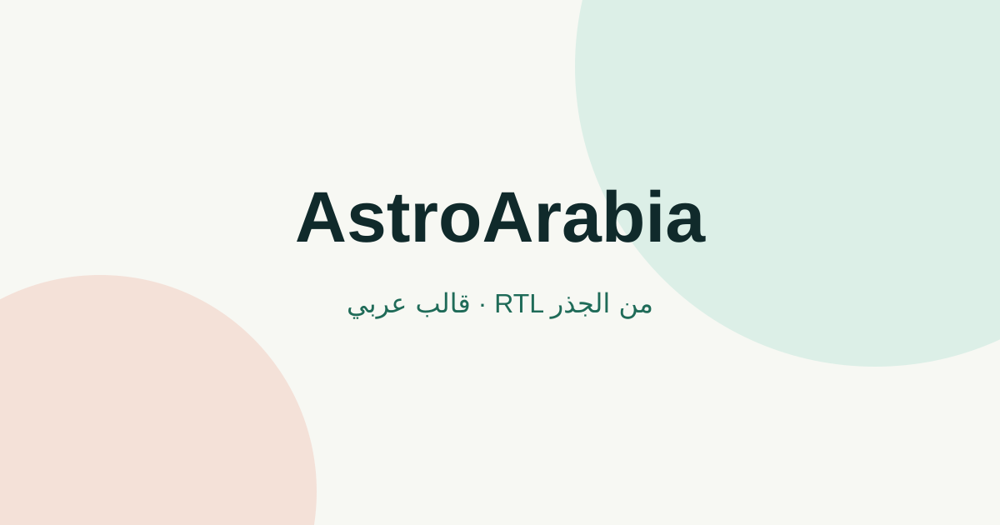

# AstroArabia

[🇸🇦 العربية](./README.md) | [🇬🇧 English](./README.en.md)

[](./LICENSE)




قالب Astro عربي مفتوح المصدر، مصمم للمجتمع التقني السعودي. يوفر نقطة بداية سريعة وواضحة للشركات والمنتجات الرقمية والمشاريع الشخصية، مع RTL أصيل وأقل قدر ممكن من JavaScript.

## المميزات الرئيسية

• مبني على Astro لإخراج صفحات ثابتة وسريعة.

• متكامل مع Tailwind CSS v4 ونظام ألوان ومسافات قابل للتخصيص.

• RTL-first في التخطيطات والمسافات والتفاعلات الدقيقة.

• نموذج التواصل جاهز للتخصيص، بدون فرض مزود إرسال أو خدمة خارجية.

• وضع داكن يدعم فئة `dark:` ويحفظ اختيار الزائر محلياً.

• أساس SEO جاهز: canonical وOpen Graph وSitemap وبيانات وصفية لكل صفحة.

• خمسة مسارات جاهزة: الشركات، المنتجات الرقمية، التوثيق، معرض الأعمال، وصفحة الهبوط.

• مكونات UI قابلة لإعادة الاستخدام عبر CVA للأزرار والبطاقات.

## التثبيت السريع

```bash
npm create astro@latest -- --template https://github.com/example/astroarabia
```

بعد إنشاء المشروع:

```bash
cd astroarabia
npm install
npm run dev
```

## هيكلة المشروع

```text
src/
├── components/
│   ├── ui/                 # Button و Card بمتحكمات CVA
│   ├── SiteHeader.astro
│   ├── SiteFooter.astro
│   └── QuoteForm.astro
├── layouts/
│   └── BaseLayout.astro
├── pages/
│   ├── index.astro         # الصفحة الرئيسية
│   ├── agency/             # الشركات والخدمات
│   ├── saas/               # المنتجات الرقمية
│   ├── docs/               # التوثيق
│   ├── portfolio/          # معرض الأعمال
│   └── landing/            # صفحة الهبوط
└── styles/
    └── global.css
```

## أوامر التشغيل

| الأمر | الاستخدام |
| --- | --- |
| `npm install` | تثبيت الاعتمادات |
| `npm run dev` | تشغيل بيئة التطوير المحلية |
| `npm run build` | إنشاء نسخة الإنتاج داخل `dist` |
| `npm run check` | فحص أنواع Astro والمكونات |
| `npm test` | تشغيل اختبارات المشروع |
| `npm run lint` | فحص جودة الكود |

## تخصيص الهوية

عدل `tailwind.config.mjs` لتغيير ألوان الهوية والخطوط والمسافات من مكان واحد. الخط العربي المحلي هو IBM Plex Sans Arabic، والعناوين تستخدم Alexandria.

## إعدادات القالب

انسخ `.env.example` إلى `.env` ثم غيّر `PUBLIC_WHATSAPP_NUMBER` إلى رقم واتساب مشروعك بالأرقام فقط ومن دون علامة `+`. الرقم الموجود في القالب تجريبي حتى لا يرتبط القالب برقم شخصي.

نموذج الطلب واجهة جاهزة فقط؛ لا يرسل أي بيانات ولا يفرض عليك مزودًا خارجيًا. اربطه بالطريقة التي تناسب مشروعك، مثل Cloudflare Pages Functions أو Worker أو خدمة نماذج خارجية، مع إضافة الحماية والتحقق المناسبين.

AstroArabia متاح مجانًا للمجتمع العربي تحت رخصة [MIT](./LICENSE). استبدل الروابط والمحتوى التجريبي بهوية مشروعك قبل النشر العام.

## النشر المباشر

[](https://vercel.com/new/clone?repository-url=https://github.com/example/astroarabia)

[](https://app.netlify.com/start/deploy?repository=https://github.com/example/astroarabia)

[](https://dash.cloudflare.com/?to=/:account/pages/new/provider/github)

للنشر اليدوي، استخدم أمر البناء التالي واجعل مجلد الإخراج `dist`:

```bash
npm run build
```

## المساهمة والترخيص

المساهمات التي تحسن تجربة الويب العربي مرحب بها. راجع [دليل المساهمة](./CONTRIBUTING.md) قبل فتح طلب دمج.

المشروع مرخص بموجب [MIT](./LICENSE).
